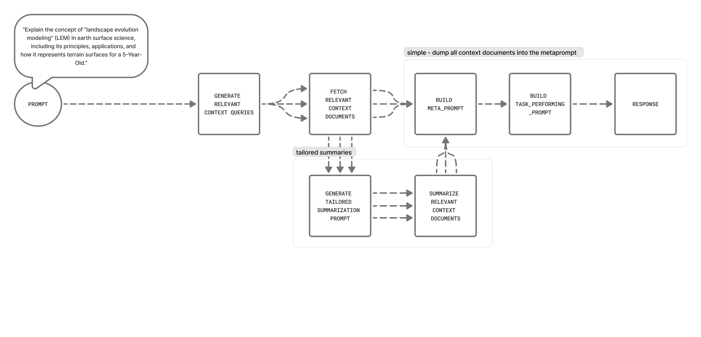

# Explain Earth Surface Modeling Concept for a 5-Year-Old 🤝

    "Explain the concept of "landscape evolution modeling" (LEM) in earth surface science, 
    including its principles, applications, and how it represents terrain surfaces for a 5-Year-Old."

> Why are we not just asking the question directly?

We can. Here are one-shot responses from:
- [chatgpt-4o](./responses/one_shot_responses/chatgpt_4o_oneshot_response.md)
- [pplx](./responses/one_shot_responses/pplx_oneshot_response.md)
- [gemini 2.5 pro](./responses/one_shot_responses/gemini_oneshot_response.md)

While perplexity's response is not bad (perplexity does research behind the scenes, visits urls, etc.), in the following sections we will attempt to improve the answer. 

Let's address 3 things specifically:
- personalization of the response
- adding relevant, credible context information for the question
- specifying the structure of the response

## Overview of the process


## 1. **Define Task**
    
    Explain the concept of "landscape evolution modeling" (LEM) in earth surface science, 
    including its principles, applications, and how it represents terrain surfaces for a 5-Year-Old.
    
    - Avoid technical jargon without explanation.
    - Focus on fundamental principles and broad understanding rather than mathematical details.
    - Ensure factual accuracy based on provided context documents only.
    
## 2. Find Relevant Context (ask pplx): 
```
    "What are the most important, credible sources to learn about landscape evolution modeling"
```

- [Landscape Evolution Modeling With Child Part 1](./context/Labs%20Landscape%20Evolution%20Modeling%20With%20Child%20Part%201/Labs%20Landscape%20Evolution%20Modeling%20With%20Child%20Part%201.md)

- [Quantitaive Modeling of Landscape Evolution](./context/Quantitative%20Modeling%20of%20Landscape%20Evolution/Quantitative%20Modeling%20of%20Landscape%20Evolution.md)

```    
    "Give me best practices on how to explain earth surface modeling concepts"
```

- [Best Practices by Perplexity](./process/context/best_practices_for_explaining_a_concept.md)

```
    "Give me best practices how to explain scientific concepts to 5 year old children"
```

- [Best Practices for Explaining Scientific Concepts to 5-Year-Olds](./context/Best%20Practices%20for%20Explaining%20Scientific%20Concepts%20to%205-Year-Olds/Best%20Practices%20for%20Explaining%20Scientific%20Concepts%20to%205-Year-Olds.md)

## 3. Build the Meta Prompt

If your context is less than 1M tokens, you can just include it entirely into Gemini 2.5 Pro Experimental 03-25 model.
If your context is larger than 1M tokens, we'll have to summarize it.

**Note**: The context size is not the only motive why you might want to summarize or process the context documents. You might want to digest the context documents under a certain perspective for instance: *"Extract all metaphors used to describe landscape evolution modeling from this context document."*

### 3.1 Dump Entire Context into the Meta Prompt

The structure of the Meta Prompt will be:
```
    Generate a high-quality TASK_PERFORMING_PROMPT for TASK based on the CONTEXT below. 
    This prompt will be used by a human user or another system to instruct an LLM to perform a specific task.

    <TASK>
    <CONTEXT>
```
Here is the actual [Meta Prompt](./meta_prompt/simple_meta_prompt.md).

### 3.2 Summarize Context

#### 3.2.1 How to make a good summary? General Summarization Prompt.
Let's summarize our context documents. But first let's ask pplx for a good summarization prompt:
```            
    *"Give me a summarization prompt that is intended to create summaries that will be used to solve the following task:
    
    TASK:
    ```
    Explain the concept of "landscape evolution modeling" (LEM) in earth surface science, 
    including its principles, applications, and how it represents terrain surfaces.
    
    - Explain like I'm 5 years old
    - Avoid technical jargon without explanation.
    - Focus on fundamental principles and broad understanding rather than mathematical details.
    - Ensure factual accuracy based on provided context documents only.
    ```
    
    IMPORTANT: The summary MUST NOT leave out specific examples, analogies, interesting facts that illustrate the idea in the text to be summarized. 
    
    Include other summarization bestpractices"*
```

**General Summarization Prompt (by pplx):**

```
    "Create a comprehensive summary of the following [content type] that maintains the essence of the original while highlighting its illustrative elements. Preserve specific examples, analogies, case studies, and interesting facts that support the main ideas. The summary should be [length constraint] and structured to include both core concepts and their supporting illustrations. Adapt the language for [target audience], while ensuring technical accuracy and maintaining the original tone. Include a brief section at the end that highlights the most compelling analogies or examples from the text."

    ## Key Best Practices for Effective Summarization

    **Be Clear and Specific**
    - Define exactly what information you need summarized and which examples to preserve
    - Specify the desired format (bullet points, paragraphs, etc.) and length constraints

    **Preserve Illustrative Elements**
    - Explicitly instruct the AI to retain examples, analogies, and interesting facts
    - Use chain-of-thought prompting to encourage deeper analysis of illustrative elements

    **Tailor to Audience**
    - Adapt technical complexity and language based on the intended audience
    - Consider specifying if the audience needs more context or background information

    **Structure Effectively**
    - Request a format that clearly distinguishes between main points and supporting examples
    - Consider using headings or sections to organize complex information

    **Combine Summarization Approaches**
    - Utilize both extractive techniques (to preserve key examples verbatim) and abstractive techniques (to connect ideas)
    - This balances preservation of specific details with overall readability

    **Review and Refine**
    - Always review AI-generated summaries for accuracy and completeness
    - Check specifically that important examples and analogies haven't been omitted

    ## Example Implementation

    "Summarize this research paper on climate change mitigation strategies, maintaining a balance between key findings and the specific case studies presented. Preserve the regional examples, statistical comparisons, and analogies used to illustrate complex concepts. Structure the summary in 300-400 words with clearly labeled sections for methodologies, findings, and practical applications. Ensure the summary is accessible to policymakers without specialized scientific backgrounds, while preserving the author's evidence-based approach. Highlight 2-3 of the most compelling examples or analogies that best illustrate the paper's central arguments."*
```

We can use the general prompt to summarize our context documents, or we can tailor it to our specific context documents.

#### 3.2.2 Tailor the General Summarization Prompt for each Context Document:
```
    Give me a summarization prompt that is intended to create a summary 
    of the document titled: <CONTEXT DOCUMENT TITLE + SHORT DESCRIPTION>.

    The summary shall be used as context for another LLM that will work on the following task:
    
    TASK:
    ```
    Explain the concept of "landscape evolution modeling" (LEM) in earth surface science, 
    including its principles, applications, and how it represents terrain surfaces.
    
    - Explain like I'm 5 years old
    - Avoid technical jargon without explanation.
    - Focus on fundamental principles and broad understanding rather than mathematical details.
    - Ensure factual accuracy based on provided context documents only.
    ```
    
    IMPORTANT: The summary MUST NOT leave out specific examples, analogies, interesting facts that illustrate the idea in the text to be summarized. 
    
    Include other summarization bestpractices.
```

Here are the actual tailored summarization prompts and the actual summaries for each context document:
| Context Document | Tailored Summarization Prompt (pplx) | Actual Summary (gpt-4o) |
|------------------|-------------------------------|----------------|
| [Best Practices for Explaining Scientific Concepts to 5-Year-Olds](./context/Best%20Practices%20for%20Explaining%20Scientific%20Concepts%20to%205-Year-Olds/Best%20Practices%20for%20Explaining%20Scientific%20Concepts%20to%205-Year-Olds.md) | [Prompt](./context/Best%20Practices%20for%20Explaining%20Scientific%20Concepts%20to%205-Year-Olds/tailored_summarization_prompt.md) | [Summary](./context/Best%20Practices%20for%20Explaining%20Scientific%20Concepts%20to%205-Year-Olds/summary.md) |
| [Labs Landscape Evolution Modeling With Child Part 1](./context/Labs%20Landscape%20Evolution%20Modeling%20With%20Child%20Part%201/Labs%20Landscape%20Evolution%20Modeling%20With%20Child%20Part%201.md) | [Prompt](./context/Labs%20Landscape%20Evolution%20Modeling%20With%20Child%20Part%201/tailored_summarization_prompt.md) | [Summary](./context/Labs%20Landscape%20Evolution%20Modeling%20With%20Child%20Part%201/summary.md) |
| [Landscape Evolution Modeling](./context/Landscape%20Evolution%20Modeling/Landscape%20Evolution%20Modeling.md) | [Prompt](./context/Landscape%20Evolution%20Modeling/tailored_summarization_prompt.md) | [Summary](./context/Landscape%20Evolution%20Modeling/summary.md) |
| [Quantitative Modeling of Landscape Evolution](./context/Quantitative%20Modeling%20of%20Landscape%20Evolution/Quantitative%20Modeling%20of%20Landscape%20Evolution.md) | [Prompt](./context/Quantitative%20Modeling%20of%20Landscape%20Evolution/tailored_summarization_prompt.md) | [Summary](./context/Quantitative%20Modeling%20of%20Landscape%20Evolution/summary.md) |

#### 3.2.3 Build the Tailored Context Summaries Meta Prompt
The structure of the Meta Prompt will be:
```
    Generate a high-quality TASK_PERFORMING_PROMPT for TASK based on the CONTEXT below. 
    This prompt will be used by a human user or another system to instruct an LLM to perform a specific task.

    <TASK>

    <TAILORED SUMMARY OF CONTEXT DOCUMENT 1>
    <TAILORED SUMMARY OF CONTEXT DOCUMENT 2>
    <TAILORED SUMMARY OF CONTEXT DOCUMENT 3>
    <TAILORED SUMMARY OF CONTEXT DOCUMENT 4>
```
Here is the actual [Meta Prompt that uses tailored context document summaries.](./meta_prompt/tailored_context_summaries_meta_prompt.md)

## 4. Run the Prompts: `META_PROMPT` → `TASK_PERFORMING_PROMPT` → `RESPONSE`

1. **Generate the `TASK_PERFORMING_PROMPT`**:

   * The `META_PROMPT` is used to generate the `TASK_PERFORMING_PROMPT` with each of the three LLMs (PPLX, ChatGPT 4.0, Gemini 2.5 Pro).
2. **Generate the `RESPONSE`**:

   * The same LLM that was used to generate the `TASK_PERFORMING_PROMPT` is used to generate the final `RESPONSE`.

The table below organizes the flow of documents across both the **meta\_prompt** and **performing\_prompt** stages, as well as the **performing\_prompt\_responses** generated by each model. The "simple" category refers to the case when the context documents are dumped as is, while the "tailored" category uses tailored summarization prompts for each context document is personalized based on context summaries.

|              | **meta\_prompt**                                                                                         | **performing\_prompt**                                                                                                | **performing\_prompt\_responses**                                                                                                                            |
| ------------ | -------------------------------------------------------------------------------------------------------- | --------------------------------------------------------------------------------------------------------------------- | ------------------------------------------------------------------------------------------------------------------------------------------------------------ |
| **simple**   | [simple\_meta\_prompt.md](./meta_prompt/simple_meta_prompt.md)                                           | [chatgpt\_4o\_simple\_performing\_prompt.md](./performing_prompt/simple/chatgpt_4o_simple_performing_prompt.md)       | [chatgpt\_4o\_simple\_response.md](./responses/performing_prompt_responses/simple/chatgpt_4o_simple_response.md)                                             |
|              |                                                                                                          | [gemini\_simple\_performing\_prompt.md](./performing_prompt/simple/gemini_simple_performing_prompt.md)                | [gemini\_simple\_response.md](./responses/performing_prompt_responses/simple/gemini_simple_response.md)                                                      |
|              |                                                                                                          | [pplx\_simple\_performing\_prompt.md](./performing_prompt/simple/pplx_simple_performing_prompt.md)                    | [pplx\_simple\_response.md](./responses/performing_prompt_responses/simple/pplx_simple_response.md)                                                          |
| **tailored** | [tailored\_context\_summaries\_meta\_prompt.md](./meta_prompt/tailored_context_summaries_meta_prompt.md) | [chatgpt\_4o\_tailored\_performing\_prompt.md](./performing_prompt/tailored/chatgpt_4o_tailored_performing_prompt.md) | [chatgpt\_4o\_tailored\_context\_summaries\_response.md](./responses/performing_prompt_responses/tailored/chatgpt_4o_tailored_context_summaries_response.md) |
|              |                                                                                                          | [gemini\_tailored\_performing\_prompt.md](./performing_prompt/tailored/gemini_tailored_performing_prompt.md)          | [gemini\_tailored\_context\_summaries\_response.md](./responses/performing_prompt_responses/tailored/gemini_tailored_context_summaries_response.md)          |
|              |                                                                                                          | [pplx\_tailored\_performing\_prompt.md](./performing_prompt/tailored/pplx_tailored_performing_prompt.md)              | [pplx\_tailored\_context\_summaries\_response.md](./responses/performing_prompt_responses/tailored/pplx_tailored_context_summaries_response.md)              |


## So, was it worth it? (Evaluation of Responses)
Now let's compare whether the effort of going through the tailored summarization process was worth it. We can compare the responses manually, or (again) ask LLM to do this for us:
```
    Your task is to compare 2 LLM answers to the same question. Analyze and compare the quality of the responses.
    
    Question:
    """
    Explain the concept of "landscape evolution modeling" (LEM) in earth surface science, 
    including its principles, applications, and how it represents terrain surfaces for a 5-Year-Old.
    """

    Answer 1:
    <SIMPLE RESPONSE BY PROVIDER X>
    Answer 2:
    <TAILORED RESPONSE BY PROVIDER X>
```

For brevity, I will compare simple and tailored responses generated ONLY by `gemini 2.5 pro`:

**Answer 1**: [gemini\_simple\_response.md](./responses/performing_prompt_responses/simple/gemini_simple_response.md)  
**Answer 2**: [gemini\_tailored\_context\_summaries\_response.md](./responses/performing_prompt_responses/tailored/gemini_tailored_context_summaries_response.md)

### 🦾 Comparison by `chatgpt-4o`:

**Conclusion**

Answer 1: This answer offers more detail and covers a broader range of concepts, but its complexity and length might be too much for a 5-year-old. However, it’s rich in examples, helping the young audience develop a deeper understanding, albeit at the risk of overwhelming them.

Answer 2: This response is much simpler and more playful, maintaining a fun, storytelling approach that's ideal for younger children. While it's less comprehensive, it does a great job at making LEM accessible without diving into too much complexity.

[Full Comparison by `chatgpt-4o`](./evaluation/chatgpt-4o-evaluates-gemini.md)

### 🦾 Comparison by `pplx`:
**Conclusion**

Answer 2 demonstrates greater effectiveness for a 5-year-old audience through:

- More consistent child-appropriate language and tone
- Better conceptual framing with the "Earth Changer Game" metaphor
- More engaging conversational style
- Stronger connections between familiar objects and complex concepts

While both answers successfully simplify the topic, Answer 2 more thoroughly adapts the material for the developmental stage and attention span of a 5-year-old while maintaining the core concepts of landscape evolution modeling

> [Full Comparison by `pplx`](./evaluation/pplx-evaluates-gemini.md)

### 🦾 Comparison by `gemini 2.5 pro` :
**Conclusion**

While Answer 1 is a good, solid explanation, Answer 2 is superior for a 5-year-old audience.
It is more consistently engaging and uses a more enthusiastic, child-friendly tone throughout.
Its central analogy of the "Earth Changer Game" and the "Earth detectives" provides a stronger, more memorable framework.

It employs a wider range of vivid and relatable analogies.

Its section headings and overall structure are better tailored to a young child's understanding and attention span.
It provides more concrete examples of what LEMs can model (e.g., glaciers, climate change impacts on landscapes) in a way that is accessible.

Both answers successfully simplify the core concepts, but Answer 2 does so with a higher degree of creativity and sustained engagement perfectly suited to the target age group.

> [Full Comparison by `gemini 2.5 pro`](./evaluation/gemini-evaluates-gemini.md)


## ✍️🦾 Final Conclusion: Orchestrating AI for Optimal Results

The exercise demonstrated the tangible benefits of not directly posing the main question to an LLM without context. Instead, stepping back to gather domain-specific information, best practices on explanation methodologies, and guidelines on adapting scientific concepts for young audiences significantly improved the tailored nature and quality of the final responses. Asking the LLM explicitly for strategies and suggestions to optimize explanations for particular contexts or audience developmental levels proved highly effective.

This approach emphasizes a more collaborative role for humans, akin to stage directors, orchestrating various "elements" (such as context documents, analogies, age-appropriate language, and structural formatting) to harmonize towards a singular intent. Rather than simple question-answer mechanics, the process engages human creativity, critical thinking, and intentional directing of LLM capabilities to produce responses uniquely adapted to specific educational or communicative goals.

They say **"a smart person is not the one who knows everything, but the one who knows where to find the answers."** Similarly, instead of attempting to solve the task in one go (single agent), it is more effective to take a step back and examine it from multiple perspectives (multi-agent approach). This involves identifying distinct perspectives (multiple agents), gathering relevant context for each perspective, and creating a structured prompt that analyzes the task comprehensively from these diverse angles.

Ultimately, the tailored response proved significantly more engaging, age-appropriate, and conceptually coherent for a 5-year-old audience, validating the effectiveness of the structured, context-informed, multi-agent approach.