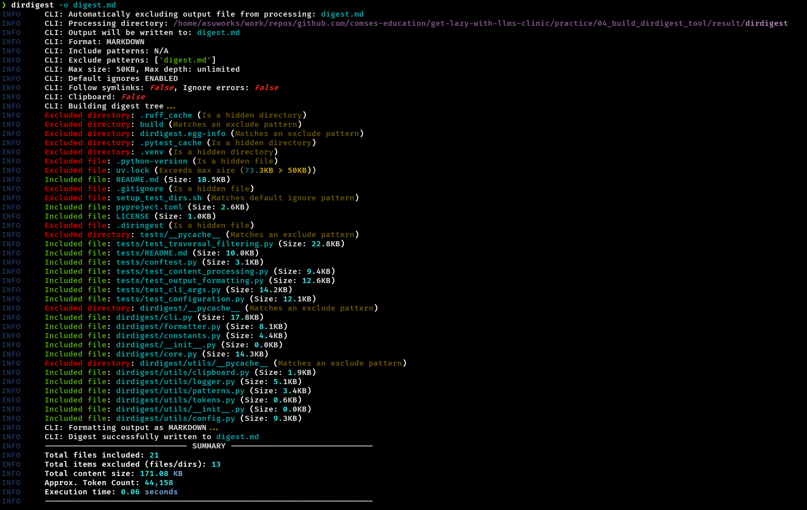

## Example Walkthroughs for Solving Tasks with LLMs 🤝

| Example                                                                                                      | `TASK`                                                                                                                                                                                                                                             | `CONTEXT`                                                                                                                                                                                                                                                                         | `INSTRUCTIONS`                                                                                                                                                                                                                                                                                                                                                                                                                                                           | **What You Will Learn**                                                         |
| :----------------------------------------------------------------------------------------------------------- | :-------------------------------------------------------------------------------------------------------------------------------------------------------------------------------------------------------------------------------------------------- | :--------------------------------------------------------------------------------------------------------------------------------------------------------------------------------------------------------------------------------------------------------------------------------------------- | :--------------------------------------------------------------------------------------------------------------------------------------------------------------------------------------------------------------------------------------------------------------------------------------------------------------------------------------------------------------------------------------------------------------------------------------------------------------------------- | :------------------------------------------------------------------------------ |
| [**1. Explain Earth Surface Modeling Concept for a 5-Year-Old**](./../practice/01_explain_concept/README.md) | Explain the concept of "landscape evolution modeling" (LEM) in earth surface science, including its principles, applications, and how it represents terrain surfaces for a 5-Year-Old.                                                             |  - Basic, age-appropriate explanations of physical earth processes (e.g., erosion, rainfall, rivers).   - Foundational texts on landscape evolution modeling (used by the LLM to ensure factual grounding).   - Literature on how terrain is shown in maps and models, simplified for visual understanding.   - Cognitive development research on how young children understand cause-effect, time, and change. | - Use simple, everyday language appropriate for a 5-year-old’s vocabulary.   - Avoid all technical terms unless clearly explained with a metaphor or analogy.   - Focus on big ideas (e.g., “Rain and rivers slowly change the shape of the land”) over detailed mechanisms.   - Use comparisons to familiar objects or situations (e.g., “The land changes like a sandbox after you pour water on it”).   - Ensure factual accuracy based on trusted geomorphology sources.   - Mention both what causes the land to change (processes) and how we draw or model the land (terrain representation).   - Keep the tone engaging, curious, and playful. | How to guide the LLM to approach the solution of the task from multiple perspectives by providing various context documents     |
| [**2. Generate Landlab Overland Flow Model**](./../practice/02_generate_landlab_model/README.md)             | Generate a  Python script that creates a very simple overland flow simulation using Landlab's OverlandFlow component.                                                                                                                               |  - Landlab documentation and API reference.   - Overland Flow Component user guide.                                                                                                                                                                                                       | - Follow PEP 8 style guide.   - Ensure the script is runnable and includes import statements, model setup, time loop, and output.   - Use clear comments to explain each part of the script.                                                                                                                                                                                                                                                                             | How to use various sources (URLs, PDFs, Github repositories) including huge repositories like https://github.com/landlab/landlab as context for LLMs   Learn how to use the [gitingest tool](https://github.com/cyclotruc/gitingest)          |
| [**3. Containerize the Overland Flow Model**](./03_containerize_landlab_model/README.md)                     | Create a Dockerfile and associated configuration files to containerize a Python-based earth surface modeling application.                                                                                                                           |  - Docker Best practices.   - Python containerization examples.   - Docker multi-stage build patterns.   - Deployment considerations for scientific applications.                                                                                                           | - Follow Docker Best practices (minimize layers, reduce image size).   - Ensure reproducibility of the environment.   - Consider data volume mounting for model inputs/outputs.   - Include clear documentation on how to build and run the container.   - Security considerations for production deployment.                                                                                         | How to containerize a landlab Python model using Best practices |
| [**4. Build Directory Digest Tool for LLM Context**](./04_build_dirdigest_tool/README.md)                    | Create a python command line tool called `dirdigest` which helps the user to create a digest (a markdown or json file) of all directories and files by recursively concatenating all content of all files in order to be ingested for an LLM as context for user's prompt. |  - Best practices on how to build CLI applications with Python.   - Best practices on human-friendly command line outputs  - Concepts of directory traversal, glob filtering, clipboard interaction, and format options.   - Use of common Python libraries (e.g., `os`, `pathlib`, `argparse`, `json`, `pyperclip`).                                             | - CLI must match provided options and behaviors (e.g., default to clipboard output, support for `--format`, `--include`, `--exclude`, `--max-size`, `--no-default-ignore`, `--output`).   - Output formats should follow structure in README (Markdown digest, nested JSON).   - Include support for config file `.diringest` in YAML.   - Ensure robust encoding handling and clear usage help.                                                                       | Create a moderately complex python CLI application with tests.    |
