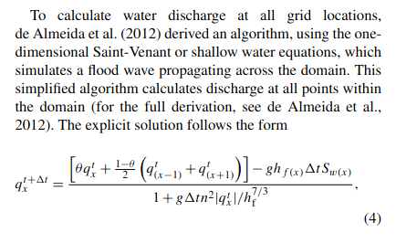
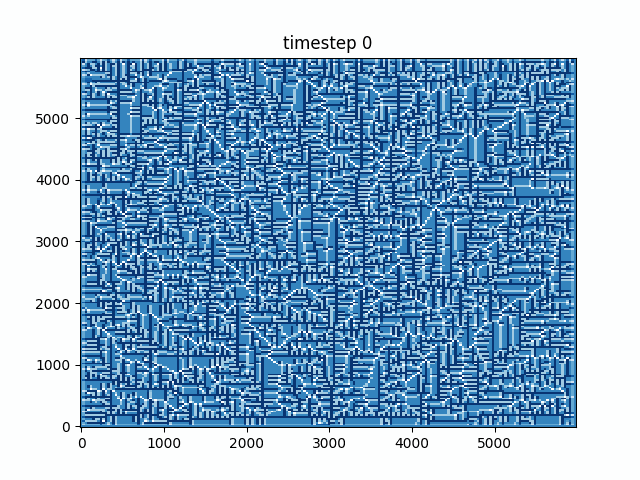

**A few quick demos showing different capabilities of LLMs**

*The example responses shown here are from GPT-4o, but most commercial LLMs should provide similarly desireable answers

# 1. Data wrangling

LLMs can be very useful for quick data transformations, either directly by feeding a dataset in and asking for a certain format to be returned, or indirectly by generating a script

Lets say we have a directory full of data files that were created by some recording instruments that we want to organize into a table:

```
Station_A12-2025-05-08T14-30-00Z.csv
Station_A12-2025-05-08T14-30-00Z.meta.csv
Station_B07-2024-12-31T23-59-59Z.csv
Station_B07-2024-12-31T23-59-59Z.meta.csv
Station_C01-2025-06-01T00-00-00Z.csv
Station_C01-2025-06-01T00-00-00Z.meta.csv
Station_D02-2025-05-15T08-45-30Z.csv
Station_D02-2025-05-15T08-45-30Z.meta.csv
Station_E03-2025-07-20T13-05-05Z.csv
Station_F04-2025-02-28T23-59-59Z.csv
Station_F04-2025-02-28T23-59-59Z.meta.csv
...
```

If the list is relatively short we can usually rely on asking for this to be done directly

**Prompt:**

> Below I have a list of files who's filenames share a standard format that reveals a station ID, the date, time, and whether the file is metadata (.meta.csv) or the actual data (.csv). Give me a markdown table with one row per recording, the columns should be: station id, date, time, metadata filename, data filename
>
>Station_A12-2025-05-08T14-30-00Z.csv
>
>Station_A12-2025-05-08T14-30-00Z.meta.csv
>
>Station_B07-2024-12-31T23-59-59Z.csv
>
>Station_B07-2024-12-31T23-59-59Z.meta.csv
>
>Station_C01-2025-06-01T00-00-00Z.csv
>
>Station_C01-2025-06-01T00-00-00Z.meta.csv
>
>Station_D02-2025-05-15T08-45-30Z.csv
>
>Station_D02-2025-05-15T08-45-30Z.meta.csv
>
>Station_E03-2025-07-20T13-05-05Z.csv
>
>Station_F04-2025-02-28T23-59-59Z.csv
>
>Station_F04-2025-02-28T23-59-59Z.meta.csv

**Response:**

>| Station ID | Date       | Time     | Metadata Filename                                 | Data Filename                             |
>|------------|------------|----------|---------------------------------------------------|-------------------------------------------|
>| A12        | 2025-05-08 | 14:30:00 | Station_A12-2025-05-08T14-30-00Z.meta.csv         | Station_A12-2025-05-08T14-30-00Z.csv       |
>| B07        | 2024-12-31 | 23:59:59 | Station_B07-2024-12-31T23-59-59Z.meta.csv         | Station_B07-2024-12-31T23-59-59Z.csv       |
>| C01        | 2025-06-01 | 00:00:00 | Station_C01-2025-06-01T00-00-00Z.meta.csv         | Station_C01-2025-06-01T00-00-00Z.csv       |
>| D02        | 2025-05-15 | 08:45:30 | Station_D02-2025-05-15T08-45-30Z.meta.csv         | Station_D02-2025-05-15T08-45-30Z.csv       |
>| E03        | 2025-07-20 | 13:05:05 | *(missing)*                                       | Station_E03-2025-07-20T13-05-05Z.csv       |
>| F04        | 2025-02-28 | 23:59:59 | Station_F04-2025-02-28T23-59-59Z.meta.csv         | Station_F04-2025-02-28T23-59-59Z.csv       |

What if we had hundreds of thousands of files in this directory, or wanted to take it offline? In the same chat, lets ask for a script to process the files with regex and return a csv

**Prompt:**

>Now create a simple python script that performs this same organization given the name of the directory. Instead of markdown, it should print a csv representing the table with the same columns from before to stdout

**Response:**
>```python
>import sys
>import os
>import re
>from collections import defaultdict
>
>def main(directory):
>    # Regex: captures station, date, time, and whether it's metadata
>    pattern = re.compile(r"^Station_(\w+)-(\d{4}-\d{2}-\d{2})T(\d{2}-\d{2}-\d{2})Z(\.meta)?\.csv$")
>
>    files = defaultdict(lambda: {"meta": None, "data": None})
>
>    for fname in os.listdir(directory):
>        m = pattern.match(fname)
>        if not m:
>            continue
>        station, date, time, is_meta = m.groups()
>        key = (station, date, time.replace("-", ":"))
>        if is_meta:
>            files[key]["meta"] = fname
>        else:
>            files[key]["data"] = fname
>
>    print("station id,date,time,metadata filename,data filename")
>    for (station, date, time), f in sorted(files.items()):
>        print(f"{station},{date},{time},{f['meta'] or '*missing*'},{f['data'] or '*missing*'}")
>
>if __name__ == "__main__":
>    if len(sys.argv) != 2:
>        print(f"Usage: {sys.argv[0]} <directory>", file=sys.stderr)
>        sys.exit(1)
>    main(sys.argv[1])
>```

# 2. Extracting an equation from an image

Many LLMs are now "multimodal" meaning that in addition to text, they have the ability to process different types of data such as images, video, audio, etc.

Lets say we want to extract the expression for the de Almeida (2012) algorithm as given in the article describing the landlab OverlandFlow component (Adams et al., 2017) in TeX syntax so that we can use it elsewhere

**Prompt:**
>This image is a snippet from a paper containing a mathematical expression, extract the full equation and return it to me as a LaTeX expression
>
>

**Response:**
>Here’s the equation from the image, written in LaTeX syntax:
>
>```latex
>q_x^{t+\Delta t} = \frac{
>\left[ \theta q_x^t + \frac{1 - \theta}{2} \left( q_{x-1}^t + q_{x+1}^t \right) \right] - g h(x) \Delta t S_w(x)
>}{
>1 + g \Delta t n^2 |q_x^t| / h_f^{7/3}
>}
>```

test it out here: https://www.quicklatex.com/

# 3. CLI wrapper

LLMs are great for writing boilerplate code. Lets say we want to wrap a script with a CLI so we can easily mess around with parameters. We'll use a [very simple overland flow simulation](./ofdemo.py) adapted from landlab's [deAlmeida Overland Flow Component tutorial](https://landlab.csdms.io/tutorials/overland_flow/overland_flow_driver.html).

**Prompt:**

>the following is a simple demo script that runs a simulation using landlab's OverlandFlow component. Wrap it in a cli so that I can configure the initial water depth and run time as command line arguments
>
>```python
>import matplotlib.pyplot as plt
>
>from landlab.components.overland_flow import OverlandFlow
>from landlab.io import esri_ascii
>
>run_time = 100  # total simulation duration (s)
>h_init = 0.1  # initial water depth (m)
>n = 0.01  # Manning's n
>g = 9.8  # gravity (m/s^2)
>alpha = 0.7  # time-step factor
>u = 0.4  # constant velocity
>
>with open("Square_TestBasin.asc") as fp:
>    rmg = esri_ascii.load(fp, name="topographic__elevation", at="node")
>
>rmg.set_closed_boundaries_at_grid_edges(True, True, True, True)
>my_outlet_node = 100
>rmg.status_at_node[my_outlet_node] = 1
>rmg.add_zeros("surface_water__depth", at="node")
>rmg.at_node["surface_water__depth"] += h_init
>
>of = OverlandFlow(rmg, steep_slopes=True)
>
>elapsed_time = 1.0
>while elapsed_time < run_time:
>    dt = of.calc_time_step()
>    of.overland_flow()
>    elapsed_time += dt
>
>elapsed_time = 1.0
>rmg.at_node["surface_water__depth"][:] = h_init
>
>while elapsed_time < run_time:
>    dt = of.calc_time_step()
>    of.overland_flow()
>    elapsed_time += dt
>
>rmg.imshow("surface_water__depth", cmap="Blues")
>
>plt.show()
>```


**Response:**

>Here you go — your script wrapped in a CLI using argparse with two arguments: --h-init and --run-time.
>```python
>#!/usr/bin/env python3
>
>import argparse
>import matplotlib.pyplot as plt
>
>from landlab.components.overland_flow import OverlandFlow
>from landlab.io import esri_ascii
>
>
>def main(h_init: float, run_time: float):
>    with open("Square_TestBasin.asc") as fp:
>        rmg = esri_ascii.load(fp, name="topographic__elevation", at="node")
>
>    rmg.set_closed_boundaries_at_grid_edges(True, True, True, True)
>    my_outlet_node = 100
>    rmg.status_at_node[my_outlet_node] = 1
>    rmg.add_zeros("surface_water__depth", at="node")
>    rmg.at_node["surface_water__depth"] += h_init
>
>    of = OverlandFlow(rmg, steep_slopes=True)
>
>    elapsed_time = 1.0
>    while elapsed_time < run_time:
>        dt = of.calc_time_step()
>        of.overland_flow()
>        elapsed_time += dt
>
>    elapsed_time = 1.0
>    rmg.at_node["surface_water__depth"][:] = h_init
>
>    while elapsed_time < run_time:
>        dt = of.calc_time_step()
>        of.overland_flow()
>        elapsed_time += dt
>
>    rmg.imshow("surface_water__depth", cmap="Blues")
>    plt.show()
>
>
>if __name__ == "__main__":
>    parser = argparse.ArgumentParser(description="Run OverlandFlow simulation.")
>    parser.add_argument("--h-init", type=float, default=0.1, help="Initial water depth (m)")
>    parser.add_argument("--run-time", type=float, default=100.0, help="Total run time (s)")
>    args = parser.parse_args()
>
>    main(h_init=args.h_init, run_time=args.run_time)
>```

Now to test it out

```bash
$ python ofdemo-cli.py --help

usage: ofdemo-cli.py [-h] [--h-init H_INIT] [--run-time RUN_TIME]

Run OverlandFlow simulation.

options:
  -h, --help           show this help message and exit
  --h-init H_INIT      Initial water depth (m)
  --run-time RUN_TIME  Total run time (s)
```

# 4. Visualizations

Visualizations are another such thing that are extremely useful to us humans but can be quite painful to create and tweak. We'll use the same overland flow simulation script which currently only plots the resulting frame when the simulation is finished. Lets turn that into an animation showing each time step.

**Prompt:**

>the following is a simple demo script that runs a simulation using landlab's OverlandFlow component. Currently it generates one plot of the grid at the end of the simulation. Instead, change it to output an animation where each frame is a time step in the simulation. The animation should be a gif saved to disk
>
>```python
>import matplotlib.pyplot as plt
>
>from landlab.components.overland_flow import OverlandFlow
>from landlab.io import esri_ascii
>
>run_time = 100  # total simulation duration (s)
>h_init = 0.1  # initial water depth (m)
>n = 0.01  # Manning's n
>g = 9.8  # gravity (m/s^2)
>alpha = 0.7  # time-step factor
>u = 0.4  # constant velocity
>
>with open("Square_TestBasin.asc") as fp:
>    rmg = esri_ascii.load(fp, name="topographic__elevation", at="node")
>
>rmg.set_closed_boundaries_at_grid_edges(True, True, True, True)
>my_outlet_node = 100
>rmg.status_at_node[my_outlet_node] = 1
>rmg.add_zeros("surface_water__depth", at="node")
>rmg.at_node["surface_water__depth"] += h_init
>
>of = OverlandFlow(rmg, steep_slopes=True)
>
>elapsed_time = 1.0
>while elapsed_time < run_time:
>    dt = of.calc_time_step()
>    of.overland_flow()
>    elapsed_time += dt
>
>elapsed_time = 1.0
>rmg.at_node["surface_water__depth"][:] = h_init
>
>while elapsed_time < run_time:
>    dt = of.calc_time_step()
>    of.overland_flow()
>    elapsed_time += dt
>
>rmg.imshow("surface_water__depth", cmap="Blues")
>
>plt.show()
>```

**Response:**
>Alright, here's an update that outputs a .gif animation of the water depth evolving over time.
>
>We'll use matplotlib.animation.FuncAnimation and pillow as the writer
>```python
>import matplotlib.pyplot as plt
>import matplotlib.animation as animation
>
>from landlab.components.overland_flow import OverlandFlow
>from landlab.io import esri_ascii
>
>run_time = 100  # total simulation duration (s)
>h_init = 0.1  # initial water depth (m)
>n = 0.01  # Manning's n
>g = 9.8  # gravity (m/s^2)
>alpha = 0.7  # time-step factor
>u = 0.4  # constant velocity
>
>with open("Square_TestBasin.asc") as fp:
>    rmg = esri_ascii.load(fp, name="topographic__elevation", at="node")
>
>rmg.set_closed_boundaries_at_grid_edges(True, True, True, True)
>my_outlet_node = 100
>rmg.status_at_node[my_outlet_node] = 1
>rmg.add_zeros("surface_water__depth", at="node")
>rmg.at_node["surface_water__depth"] += h_init
>
>of = OverlandFlow(rmg, steep_slopes=True)
>
>elapsed_time = 1.0
>frames = []
>rmg.at_node["surface_water__depth"][:] = h_init
>
>while elapsed_time < run_time:
>    dt = of.calc_time_step()
>    of.overland_flow()
>    elapsed_time += dt
>    frames.append(rmg.at_node["surface_water__depth"].copy())
>
>fig, ax = plt.subplots()
>x, y = rmg.node_x.reshape(rmg.shape), rmg.node_y.reshape(rmg.shape)
>depth = frames[0].reshape(rmg.shape)
>mesh = ax.pcolormesh(x, y, depth, cmap="Blues", shading="auto")
>title = ax.set_title("")
>
>def update(i):
>    mesh.set_array(frames[i].reshape(-1))
>    title.set_text(f"timestep {i}")
>    return mesh,
>
>ani = animation.FuncAnimation(fig, update, frames=len(frames), interval=50)
>ani.save("ofanimation.gif", writer="pillow", fps=10)
>
>print("Saved ofanimation.gif")
>```

Here is the resulting animation after running the new script:

