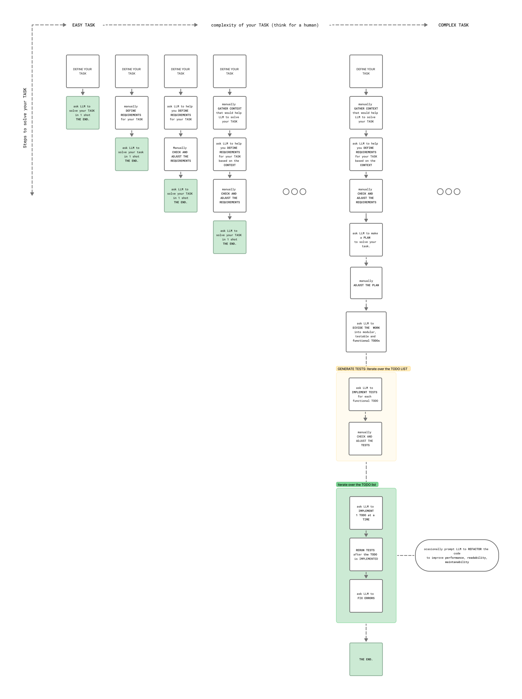

# A Method for Solving Complex Tasks with LLMs 🤝

## Epistemology of Tasks
| **Task Type**                       | **Description**                                              | **Prompt Strategy**                                                                                               | **Example Task**                                      |
|------------------------------------|--------------------------------------------------------------|--------------------------------------------------------------------------------------------------------------------|--------------------------------------------------------|
| `Easy Task` (Known Knowns)           | The task is straightforward and familiar                     | `"Do <TASK>"`                                                                                                      | "Sort this list alphabetically."                      |
| `Moderate Task` (Known Unknowns - X) | You know *what* you don’t know (e.g., best practices for X) | 1. `"What are best practices to do X?"` → *LLM returns `BEST_PRACTICES_TO_SOLVE_X`*<br>2. `"Use best <BEST_PRACTICES_TO_SOLVE_X>, do <TASK>"`           | "Write secure Python code to handle file uploads."     |
| `Difficult Task` (Unknown Unknowns)  | You don’t know what you don’t know| *Requires iterative prompting, clarification, decomposition, or exploration*                                       | "Design a prompt generation framework for multi-agent systems." |

## How to Solve Tasks with LLMs



## Axiom: To solve a complex task, we need (at least) a complex prompt.

While it might be enough to type a  few words into ChatGPT to solve a simple task, it is very beneficial to create complex structured prompts to solve more complicated tasks.

See [Examples of Better Prompts](./Examples%20of%20Better%20Prompts.md) for examples of simple vs complex prompts.


## Never write complex prompts by hand.
[Use LLMs to help you write a good prompt](./Use%20LLMs%20to%20Help%20You%20Write%20a%20Better%20Prompt.md)

## Coding Tasks Method
> For simple tasks, the prompts provided here will work fine. For more complex tasks enhance your prompts with additional context for better results.

1. **Start your project with a working template.** A python project can be started with a best practices template project (ex. [minimal python project](https://github.com/asuworks/minimal_python_project/blob/main/README.md)). 
   
        "Give me a best practices template for ..."

2. **Research and save context to your local machine.** Use perplexity to research. Save research results to a local folder in markdown format.

    ```
    What are the best practices, 
    architecture designs, 
    technical requirements, 
    libraries, 
    tech stack,  etc.
    for <TASK>
    ```

    ```
    Come up with 3 different strategies to implement <TASK>
    ```
    

3. **Plan before Code.** Ask to plan before coding: 

    ```
    Create an imlementation plan for task <TASK>
    With following requirements <REQUIREMENTS>
    Use the following context for reference <CONTEXT>

    Create small, modular, testable components.    
    ```

4. **Divide and Conquer.** Work on small tasks: 1 TODO at a time. Renew chat for every new TODO.

    ```
    Split the following implementation plan into consequent modular TODOs:
    <PLAN>
    ```

5. **Test before Code.** Use Test Driven Development. **Check if generated tests make sense.** This is your source of truth.

    ```
    Here is a digest of my repository: <GITINGEST_MARKDOWN_FILE>
    Create a plan for a test suite for this repository.
    IMPORTANT: the goal of the test suite is to test behavior not implementation details.
    ```

    ```
    Here is a digest of my repository: <GITINGEST_MARKDOWN_FILE>
    Here is a plan for the testing suite: <TESTING_PLAN>
    Create tests.
    ```

6. **Chase gnarly bugs with `log.debug()`**

    ```
    Add relevant debug logs to analyze why the program fails. I will give you console outputs.
    IMPORTANT: YOU ARE ALLOWED TO ADD DEBUG LOGGING STATEMENTS ONLY. DO NOT TOUCH ANY OTHER CODE.
    ```
7. **Commit often.** If tests pass, **commit to git**, if not iterate.

## Non-coding Tasks Method

1. **Gather context** for your task.
2. **Create a detailed prompt**

    ```
    Solve my <TASK>
    Given the <CONTEXT>
    ```
