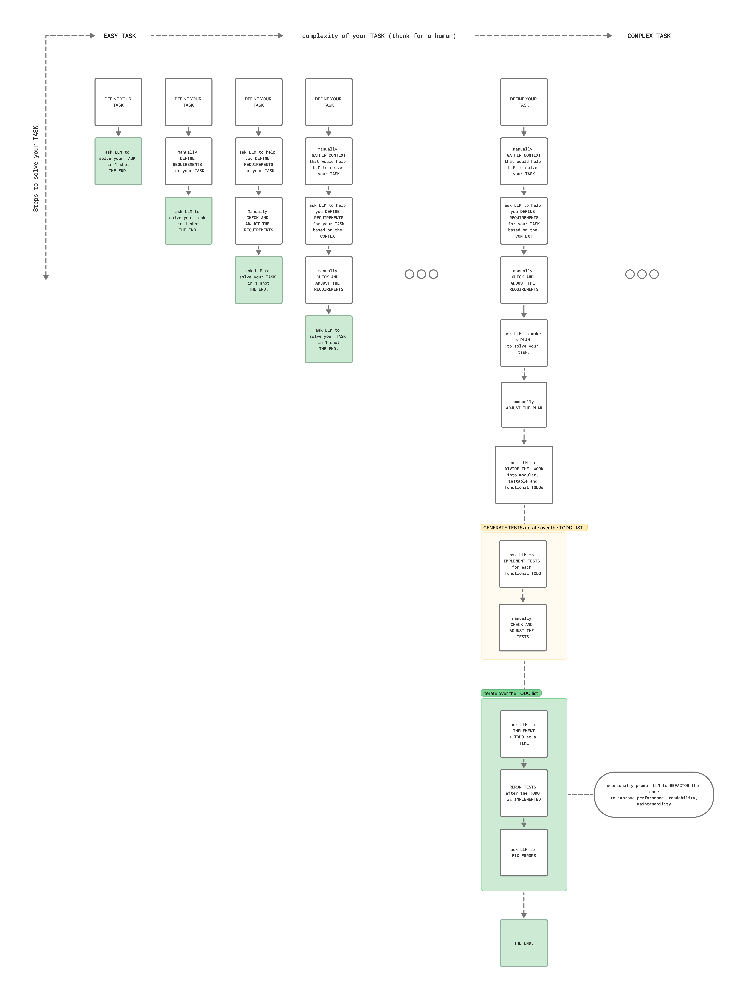

## Epistemology of Tasks
| **Task Type**                       | **Description**                                              | **Prompt Strategy**                                                                                               | **Example Task**                                      |
|------------------------------------|--------------------------------------------------------------|--------------------------------------------------------------------------------------------------------------------|--------------------------------------------------------|
| `Easy Task` (Known Knowns)           | The task is straightforward and familiar                     | `"Do <TASK>"`                                                                                                      | "Sort this list alphabetically."                      |
| `Moderate Task` (Known Unknowns - X) | You know *what* you don’t know (e.g., best practices for X) | 1. `"What are best practices to do X?"` → *LLM returns `BEST_PRACTICES_TO_SOLVE_X`* 2. `"Use best <BEST_PRACTICES_TO_SOLVE_X>, do <TASK>"`           | "Write secure Python code to handle file uploads."     |
| `Difficult Task` (Unknown Unknowns)  | You don’t know what you don’t know| *Requires iterative prompting, clarification, decomposition, or exploration*                                       | "Design a prompt generation framework for multi-agent systems." |

## How to Solve Tasks with LLMs

## Axiom: To solve a complex task, we need (at least) a complex prompt.

While it might be enough to type a  few words into ChatGPT to solve a simple task, it is very benefitial to create complex structured prompts to solve more complicated tasks.

See [Effective LLM Prompting Strategies: From Simple to Complex](./theory/Effective%20LLM%20Prompting%20Strategies:%20From%20Simple%20to%20Complex.md)
for examples of simple vs complex prompts.

## Never write complex prompts by hand.
[Use LLMs to help you write a good prompt](./theory/Use%20LLMs%20to%20help%20you%20write%20a%20good%20prompt.md)
